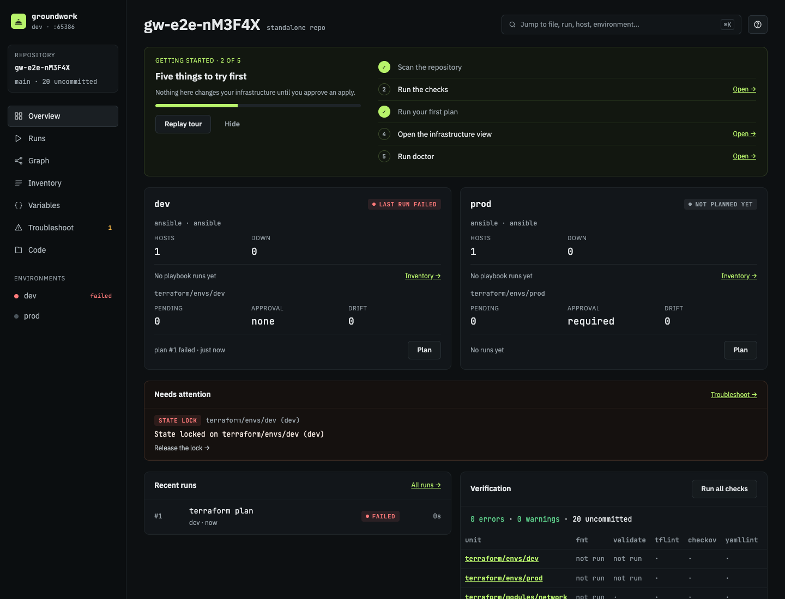
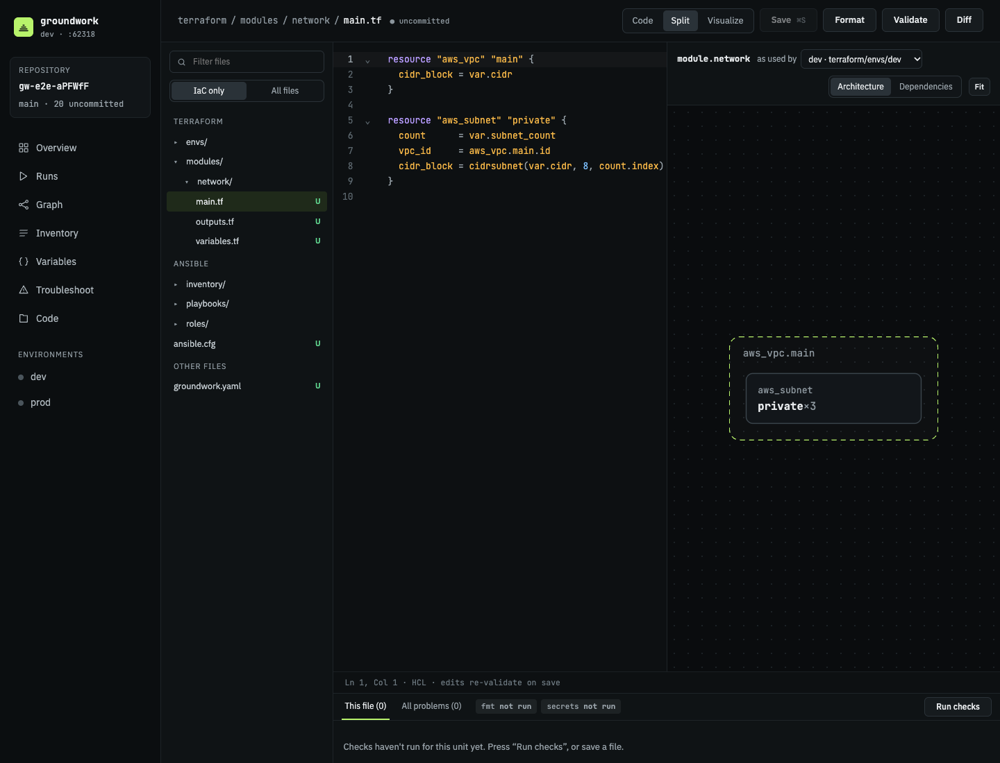
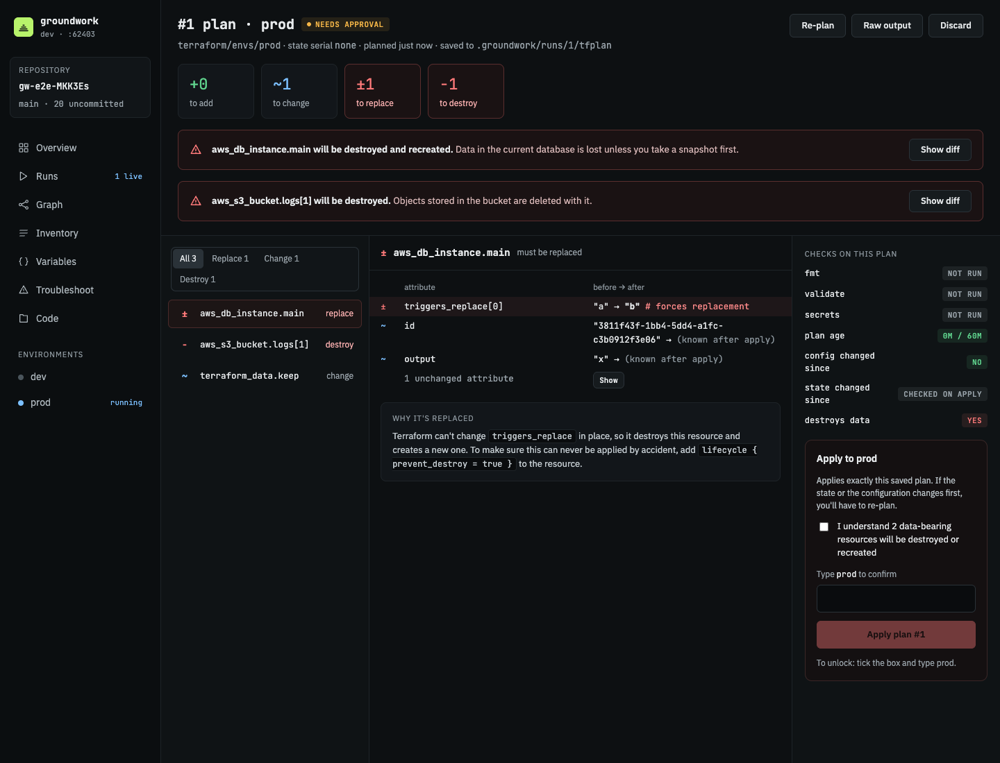
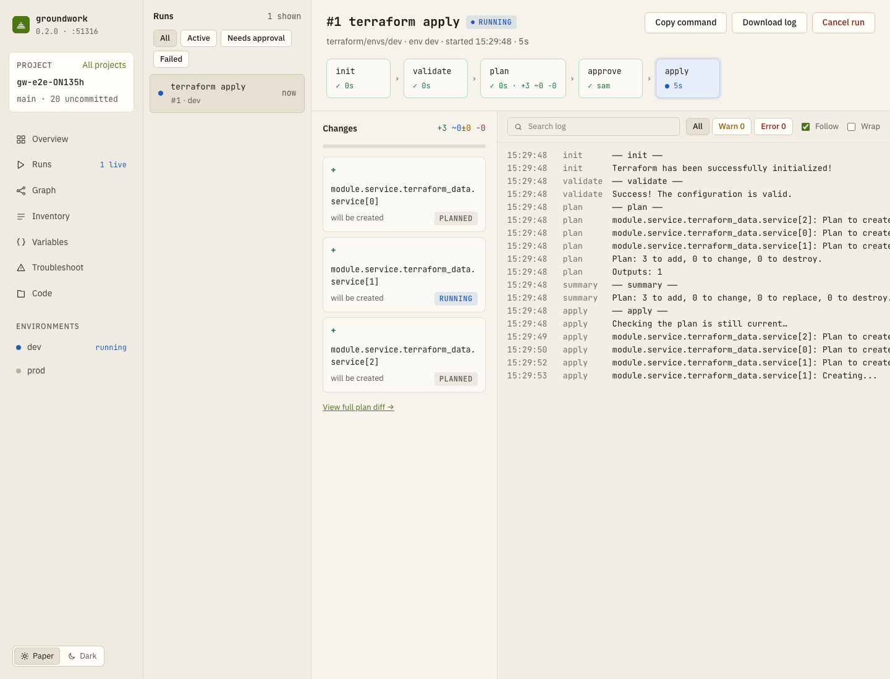
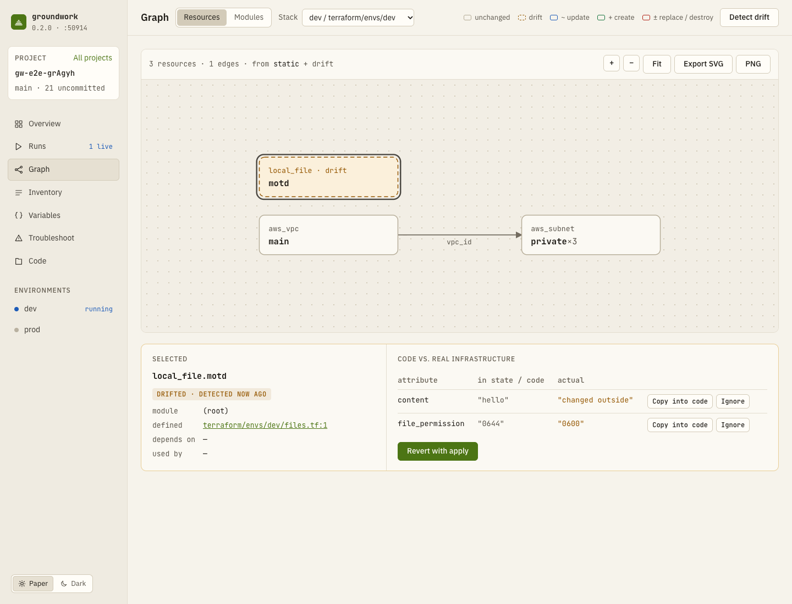
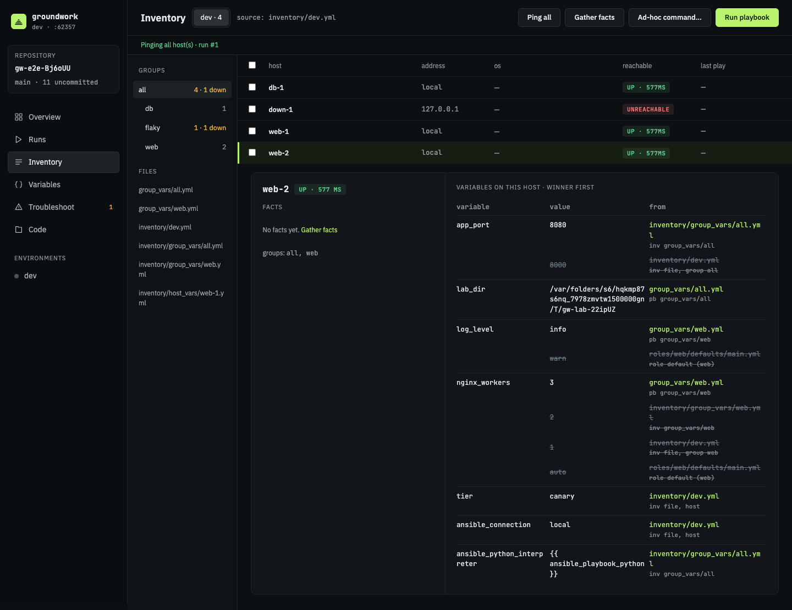
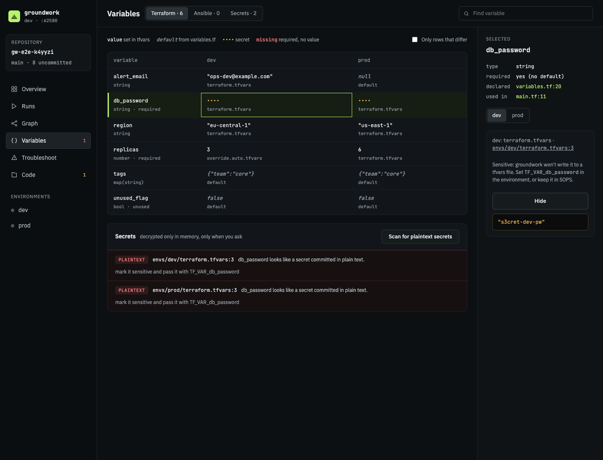

# groundwork

A local web console for Terraform and Ansible. Run it inside a repository and it detects your infrastructure code, checks it as you edit, runs plans, applies and playbooks with live logs, and explains failures with a fix. One binary, no accounts, nothing leaves your machine except through the tools you already use.

```sh
cd your-infra-repo
groundwork
```

It opens `http://127.0.0.1:7420` in your browser.



## What it does

- **Detects** Terraform roots, modules and Ansible projects, in a dedicated infrastructure repo or in an application repo that keeps them in a subfolder, and writes a `groundwork.yaml` you can review. An empty repo gets a scaffold instead ([setup](docs/setup.md)).
- **Checks on every save**: `fmt`, `validate`, tflint, checkov, yamllint, ansible-lint, playbook syntax and a plaintext-secret scan, with problems inline in the editor ([checks](docs/checks.md)).
- **Plans, then applies only what you approved**: plan review with masked sensitive values and danger flags, typed confirmation for production, and the exact saved plan applied. A plan that went stale (code, state or time) can't be applied ([runs](docs/runs.md)).
- **Ansible**: inventory with reachability and facts, variable provenance per host, dry run → approve → run, ad-hoc commands ([ansible](docs/ansible.md)).
- **Graph and drift**: resource dependency graph, an architecture view that follows unsaved edits, refresh-only drift detection with copy / ignore / revert, optionally on a schedule with notifications ([graph](docs/graph.md)).
- **Variables and secrets**: per-environment variable matrix with sources, SOPS and ansible-vault values revealed on request, moving plaintext secrets into the vault ([variables](docs/variables.md)).
- **Troubleshooting**: failures matched to known causes (stale state locks, expired credentials, unreachable hosts, …) with guided fixes, and a Doctor for your tools, credentials and backends ([troubleshooting](docs/troubleshooting.md)).

| | |
|---|---|
|  |  |
|  |  |
|  |  |

## Install

macOS and Linux (amd64, arm64).

```sh
curl -fsSL https://raw.githubusercontent.com/rapando/groundwork/main/install.sh | sh
# or, from source (Go 1.27+)
go install github.com/rapando/groundwork/cmd/groundwork@latest
```

groundwork uses the `terraform` (or `tofu`) and `ansible` on your PATH, plus any linters you have. `groundwork doctor` shows what it found. See [install](docs/install.md) for checksums and the install script's options.

## Commands

| | |
|---|---|
| `groundwork` | detect, set up if needed, serve, open the browser (`--port`, `--no-open`) |
| `groundwork init [--detect] [--yes]` | write `groundwork.yaml` (or scaffold an empty repo) without the UI |
| `groundwork check [--json]` | run all checks once; non-zero exit on problems (for CI) |
| `groundwork doctor [--json]` | tools, credentials, backends, SSH agent, disk |
| `groundwork drift [--env prod]` | refresh-only drift check of every environment |
| `groundwork version` | |

## Safety

- The server listens on `127.0.0.1` only. Every request needs the session token from the URL it prints; other websites can't reach it (Host and Origin checks, strict CSP). See [security](docs/security.md).
- Nothing changes infrastructure without a plan you reviewed and approved. Production-like environments need their name typed.
- groundwork's own state lives in `.groundwork/` (git-ignored). The only file it adds to your repo is `groundwork.yaml`.

## Try it

[`examples/`](examples/) has three small repos: Terraform only, Ansible only, and an app with both. They use local providers, so they work without a cloud account:

```sh
cp -R examples/app-with-infra /tmp/demo && cd /tmp/demo && git init -q && groundwork
```

## Development

```sh
make build   # SPA (web/) + binary (bin/groundwork)
make test    # Go + web unit tests
make e2e     # browser tests (installed Chrome)
make integration  # with real terraform/ansible/linters on PATH
make perf    # 5,000-file repository timings
make fuzz    # each fuzz target for 30s
```

The UI is Vue 3 + TypeScript in `web/`, built into `internal/server/dist` and embedded in the binary. [IMPLEMENTATION_PLAN.md](IMPLEMENTATION_PLAN.md) describes the architecture; [design/](design/) holds the UI design.
