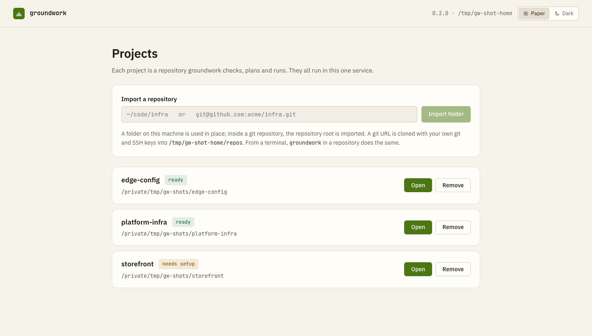
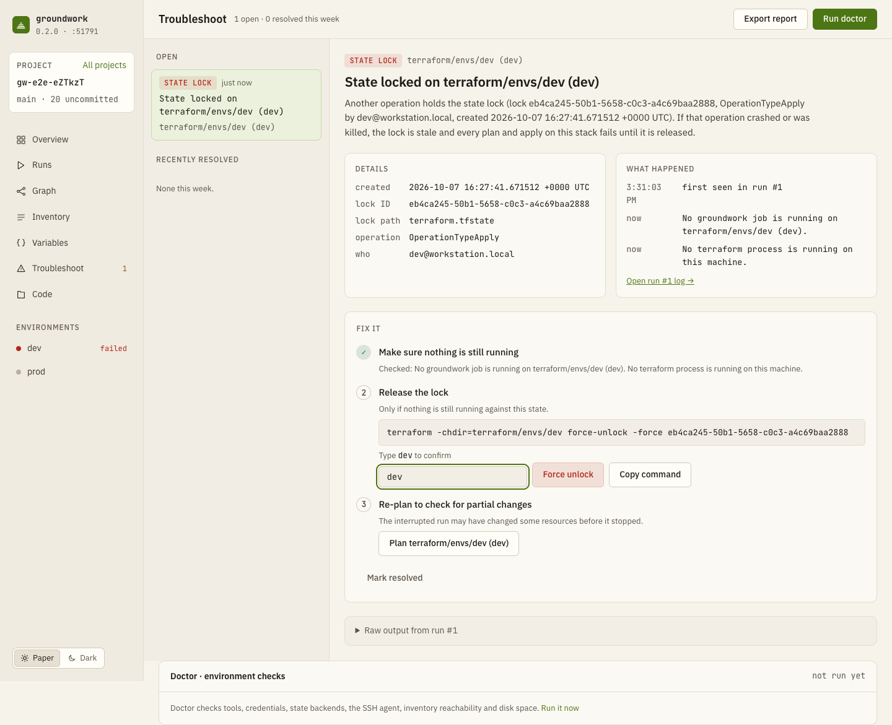

<p align="center">
  <picture>
    <source media="(prefers-color-scheme: dark)" srcset="docs/images/logo-dark.svg">
    
  </picture>
</p>

<h1 align="center">groundwork</h1>

A local web console for Terraform and Ansible. It runs as a background service on your machine and hosts all your infrastructure repositories as projects. For each one it detects your infrastructure code, checks it as you edit, runs plans, applies and playbooks with live logs, and explains failures with a fix. One binary, no accounts, nothing leaves your machine except through the tools you already use.

```sh
curl -fsSL https://raw.githubusercontent.com/rapando/groundwork/main/install.sh | sh
cd your-infra-repo
groundwork
```

`groundwork` starts the service if it isn't running, imports the repository you're in as a project and opens it at `http://127.0.0.1:7420`. Run it in other repositories to add them, or import a folder or a git URL from the console's project list. `groundwork service install` starts the service at login.


## What it does

- **One service, many projects**: every repository you import gets its own checks, runs, file watching and drift schedule, behind one console. Import a folder in place, or a git URL that groundwork clones with your own git and SSH keys ([service and projects](docs/service.md)).
- **Detects** Terraform roots, modules and Ansible projects, in a dedicated infrastructure repo or in an application repo that keeps them in a subfolder, and writes a `groundwork.yaml` you can review. An empty repo gets a scaffold instead ([setup](docs/setup.md)).
- **Checks on every save**: `fmt`, `validate`, tflint, checkov, yamllint, ansible-lint, playbook syntax and a plaintext-secret scan, with problems inline in the editor ([checks](docs/checks.md)).
- **Plans, then applies only what you approved**: plan review with masked sensitive values and danger flags, typed confirmation for production, and the exact saved plan applied. A plan that went stale (code, state or time) can't be applied ([runs](docs/runs.md)).
- **Ansible**: inventory with reachability and facts, variable provenance per host, dry run → approve → run, ad-hoc commands ([ansible](docs/ansible.md)).
- **Graph and drift**: resource dependency graph, an architecture view that follows unsaved edits, refresh-only drift detection with copy / ignore / revert, optionally on a schedule with notifications ([graph](docs/graph.md)).
- **Variables and secrets**: per-environment variable matrix with sources, SOPS and ansible-vault values revealed on request, moving plaintext secrets into the vault ([variables](docs/variables.md)).
- **Troubleshooting**: failures matched to known causes (stale state locks, expired credentials, unreachable hosts, …) with guided fixes, and a Doctor for your tools, credentials and backends ([troubleshooting](docs/troubleshooting.md)).

| | |
|---|---|
|  |  |
|  |  |
|  |  |
|  |  |

The console comes in two themes, **Paper** (the default) and **Dark**, switchable from the sidebar or ⌘K; the code editor and graph follow the theme.

## Install

macOS and Linux (amd64, arm64).

```sh
curl -fsSL https://raw.githubusercontent.com/rapando/groundwork/main/install.sh | sh
# or, from source (Go 1.27+)
go install github.com/rapando/groundwork/cmd/groundwork@latest
```

> To update

```sh
groundwork service stop
curl -fsSL https://raw.githubusercontent.com/rapando/groundwork/main/install.sh | sh
groundwork service start
```

The script verifies the download against the release checksums and installs to `~/.local/bin` without `sudo`. Then, optionally, start the service at login:

```sh
groundwork service install   # launchd on macOS, systemd --user on Linux
groundwork service status
```

Run `install` from a shell where `terraform` and `ansible` work: the login service keeps that shell's `PATH`. groundwork uses the `terraform` (or `tofu`) and `ansible` it finds there, plus any linters you have; `groundwork doctor` shows what it found.

**Upgrading:** install again, then `groundwork service stop && groundwork service start`. Coming from 0.1, where groundwork ran one server per repository in your terminal, see [upgrading to 0.2](docs/install.md#from-01-to-02).

See [install](docs/install.md) for manual downloads, checksums, the install script's options and removal.

## Commands

| | |
|---|---|
| `groundwork` | import this repository into the service (starting it if needed) and open it (`--no-open`, `--port`; `--foreground` serves in this terminal instead) |
| `groundwork add <folder \| git URL>…` | import projects; a URL is cloned into the service's data directory |
| `groundwork projects` · `open [project]` · `remove <project>` | list with status, open in the browser, stop managing (files stay) |
| `groundwork service install \| uninstall \| start \| stop \| status` | run at login, or control the background service |
| `groundwork serve [folder…]` | run the service in the foreground (what the login service runs) |
| `groundwork init [--detect] [--yes]` | write `groundwork.yaml` (or scaffold an empty repo) without the UI |
| `groundwork check [--json]` | run all checks once; non-zero exit on problems (for CI) |
| `groundwork doctor [--json]` | tools, credentials, backends, SSH agent, disk |
| `groundwork drift [--env prod]` | refresh-only drift check of every environment |
| `groundwork version` | |

## Safety

- The server listens on `127.0.0.1` only. Every request needs the session token from the URL it prints; other websites can't reach it (Host and Origin checks, strict CSP). See [security](docs/security.md).
- Nothing changes infrastructure without a plan you reviewed and approved. Production-like environments need their name typed.
- Each project's state (runs, plans, history) lives in its own `.groundwork/` (git-ignored). The only file groundwork adds to your repo is `groundwork.yaml`.
- The service keeps its project list, session token, log and cloned repositories in `~/Library/Application Support/groundwork` (macOS) or `~/.config/groundwork` (Linux); set `GROUNDWORK_HOME` to move it.

## Try it

[`examples/`](examples/) has three small repos: Terraform only, Ansible only, and an app with both. They use local providers, so they work without a cloud account:

```sh
cp -R examples/app-with-infra /tmp/demo && git -C /tmp/demo init -q
cp -R examples/ansible-only /tmp/demo-ansible && git -C /tmp/demo-ansible init -q
cd /tmp/demo && groundwork                 # opens the first project
groundwork add /tmp/demo-ansible           # a second project, on the same console
```

## Development

```sh
make build   # SPA (web/) + binary (bin/groundwork)
make test    # Go + web unit tests
make e2e     # browser tests (installed Chrome)
make integration  # with real terraform/ansible/linters on PATH
make perf    # 5,000-file repository timings
make fuzz    # each fuzz target for 30s
```

The UI is Vue 3 + TypeScript in `web/`, built into `internal/server/dist` and embedded in the binary. [IMPLEMENTATION_PLAN.md](IMPLEMENTATION_PLAN.md) describes the architecture; [design/](design/) holds the UI design.
